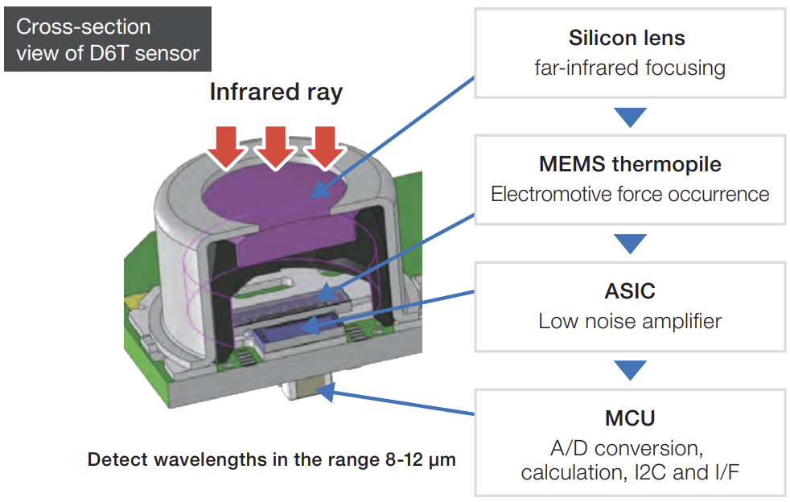
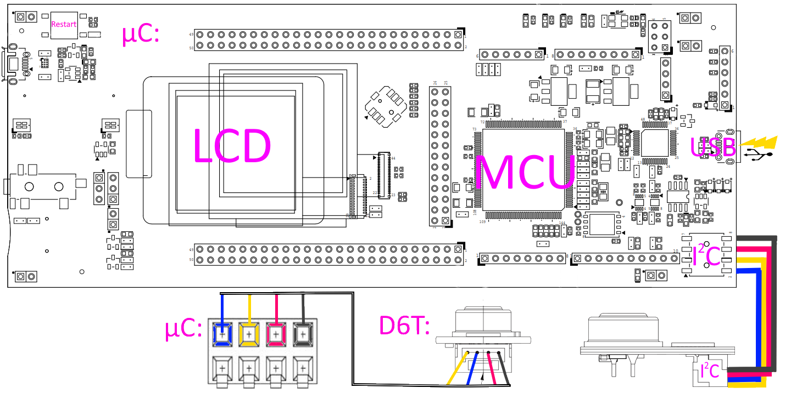

# STM_Praktikum Sensor D6T-32L-01A
/// overview
## Funktionsweise der D6T MEMS Sensoren
Abbildung 2: 

Die einfallende Infrarot-Strahlung wird durch eine Silikon-Linse auf einen Thermophilsensor gebündelt und es wird die dabei resultierende Kraft gemessen. Durch den Vergleich mit einer internen Lookup-Tabelle wird die Temperatur des Infrarot-Strahlen emittierenden Objekts ermittelt. Diese Werte können dann über das $I^2C$ Protokoll ausgelesen werden.

Der D6T-32L-01A ist in der Lage 32x32 Werte mit einer Messung zu erheben. Diese 1024 Themperaturwerte werden jeweils in ihre HIGH- und LOW-Bits zerlegt alszehnfacher Temperaturwert gespeichert und übermittelt. 

## Getting started
Für die Durchführung wurde folgendes Setup verwendet :
* Ein D6T-32L-01A IR Sensor, der mit 
* einem STM32F412G-Discovery board mit  
* einem Qwiic zu 4-male jumper pin kabel verbunden ist.

Für weitere Informationen zu dem Sensor und MikroController(kurz µC) verweise ich auf die jeweiligen Datenblätter:
* [Datenblatt D6T](https://cdn-reichelt.de/documents/datenblatt/B400/D6T_MANUAL-ENPDF.pdf) 
* [Datenblatt STM32](https://www.st.com/en/evaluation-tools/32f412gdiscovery.html#documentation)
### Verkabelung
Abbildung 3:

Die Kommunikation zwischen µC und D6T findet über das $I^2C$ Protokoll statt. Der $I^2C$ Port befindet sich auf der dem LCD-Display abgewandten kurzen Seite des µC, unterhalb des USB Connectors, der für die Stromzufuhr und Programmierung des µC verwendet wird. Der $I^2C$ Port des D6T dagegen, kann an der unterseite in Form eines Qwiic anschluss gefunden werden. Die Farben der in der Abbildung verwendeten Kabel haben die Folgende Bedeutung:
* Gelb:    SCL ($I^2C$ Clock)
* Blau:    SDA ($I^2C$ Datenleitung)
* Rot:     VCC (Stromzufuhr)
* Schwarz: GND (Ground)

### Sofftware auf dem µC installieren
. Within this software you can write the software of an opened project onto a evaluation board that is connected with usb by pressing the play button on the top middle of the Screen. At the first time the IDE will ask you about saving before running which you can accept. THe software will be written to to your board and executed immediatly. 

### Software zurücksetzen
0. Für das zurücksetzen der Software im Falle eines Fehlers ist bereits ein Watchdog Timer implementiert, der etwa alle vier Sekunden Das Programm zurücksetzt, sollte dies nicht mehr reagieren. Sollte dennoch das Programm nicht Funktionieren können folgende Schritte versucht werden:
1. Das Neu-Starten des Sensors erfolgt, in dem entweder die VCC, oder GND Leitung getrennt und neu verbunden werden
2. Das Auf den Sensor gespielte Programm lässt sich manuell neu starten, indem der Restart Knopf (Siehe Abbildung 3) gedrückt wird.

## Software Architecture and Design decisions
The presentated software to read the sensor data has been moved to a Folder called `/Core/.../sensor/` to enable the construction of different logically seperated components. This folder has an access point for the main method called `d6t.h` in which the main streamline of the constructed methods were executed. These method have been seperated into two files:
1. `.../sensor/communication.h/c` in the communication files the methods focus on getting the raw data from the sensor and interpret it in a way that it fits to a for Humans readable value in °C. Even thoug the task requests iso units, I chose not to comply as the stepsize between Kelvin and Celsius are identical and a calculation to Kelvin would only take more space on the small Display as the numbers are 272.15 bigger that Celsius's system. I decided the conversion is easy enough that it is not worth the extra space.
2. `.../sensor/render.h/c` contains the code used to visualize the data we got from the sensor on the evaluation board screen. ... /// how and why like this

## Authors
Yannick Pahlke 1841500 (@Reskuzo on Github)

