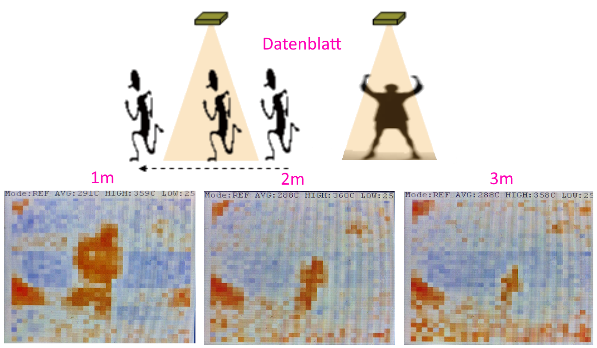

# STM_Praktikum Sensor D6T-32L-01A
Dieses Projekt bezieht sich auf den Kurs Mikrocontroller an der Unversität Bayreuth. Ziel des Kurses ist es Daten eines Sensors, in diesem Fall eines Infrarotsensors, mithilfe eines Entwicklungsboards auszulesen und auf dem Board, oder dem verbuundenen Bildschirm wiederzugeben.

Die Ausgabe der Sensorwerte erfolgt etwa alle zwei Sekunden auf dem Display des Entwicklungsboards in Form eines farbigen Bildes. Dabei werden die Temperaturwerte auf einer Farbskala, von Hoch (rot) zu niedrig (blau) über normal (weiß) abgebildet. Für diese Farbscala sind **zwei Modi** verfügbar, zwischen denen durch **halten des Joysticks bis zur nächsten Messung** nach rechts für den relativen Modus (REF), oder nach links (standart) für den absoluten Modus(ABS). 

Im **Absoluten Modus** bildet die Tiefsttemperatur des Sensors laut Datenblatt (10°C) den unteren Rand der Skala und die Höchsttemperatur (70°C) den Oberen. Dazwischen sind noch die die Temperaturn Raumtemperatur (24°) in weiß und Körertemperatur 36° in Orange festgesetzt, um einen stärkeren Ausschlag im Alltäglichen Temperaturbereich zu erziehlen. 

Im **relativen Modus** dagegen wird die tiefste gemessene Temperatur auf Blau gesetzt und die höchste gemessene Temperatur auf Rot. Die Durchschnittstemperatur wird auf Weiß festgelegtund orange bildet den Durchschnitt + 2,5°C ab. Dadurch können Objekte unabhängig von der Umgebungstemperatur besser erkannt werden. 

In welchem Modus man sich befindet, kann man sowohl an der leuchtenden LED (blau=relativer Modus, orange=Absoluter Modus, rot=keine Daten vom Sensor erhalten), als anhand des Textes am oberen Bildschirmrand (Abbildung : pink umrandet) erkennen. In dieser Zeile stehen je nach Modus auch Folgende Werte:
* HIGH: die Höchste gemessene Temperatur
* LOW: Die niedrigste gemessene Temperatur
* AVG: Die durchschnittliche Temperatur
* REF: Die Referenztemperatur im Programmcode, die als Weiß abgebildet wird

Diese Temperaturen werden aus Platzgründen jeweils in dem Zehnfachen der Temperatur in Grad Celsius angegeben. Eine angezeigte Temperatur von 371C bedeutet also eine Temperatur von 37,1°C, bzw. 371 $\cdot$ 27,415K = 310,25 Kelvin.

Abbildung : 

 In der Abbildung ist oben links das Setup mit Board und Sensor, darunter die Durchführung und rechts danneben die ergebnisse eines Durchlaufs zu sehen, bei dem ich meine Hand über den Sensor gehalten habe. Dabei zeigt das obere rechte Bild das Ergebnis im absoluten, das Untere die Temperatur im relativen Modus. Wie man erkennen kann ist der Kontrast im relativen Modus höher als im absoluten. 

 Als Anwendung des Sensors schlägt das Datenblatt das Erkennen von Menschen vor. Für das erkennen selbst gibt es meinerseits zwar keine Implementation einer automatischen Erkennung, dennoch halte ich dieses Szenario für ein gutes Beispiel, um die Auflösung des Sensors zu verdeutlichen. Im Folgenden Bild Ist zum Einen die Abbildung aus dem Datenblatt und darunter meine Messungen, bei denen ich jeweils 1m, 2m, bzw. 3m vom Sensor entfernt stehe. Dabei ist anzumerken, dass bereits auf dem zweiten Bild eine Erkennung durch Software unewahrscheinlich ist.
 

## Getting started
Für die Durchführung wurde folgendes Setup verwendet :
* Ein D6T-32L-01A IR Sensor, der mit 
* einem STM32F412G-Discovery board (hier mit µC abgekürzt) mit  
* einem Qwiic zu 4-male jumper pin kabel verbunden ist.
* ein Mikro-USB Datenkabel zur Stromversorgung und zum Programmieren des µC wird ebenfalls benötigt.

Für weitere Informationen zu dem Sensor und MikroController(kurz µC) verweise ich auf die jeweiligen Datenblätter:
* [Datenblatt D6T](https://cdn-reichelt.de/documents/datenblatt/B400/D6T_MANUAL-ENPDF.pdf) 
* [Datenblatt STM32](https://www.st.com/en/evaluation-tools/32f412gdiscovery.html#documentation)
### Verkabelung
Abbildung 3:

Die Kommunikation zwischen µC und D6T findet über das $I^2C$ Protokoll statt. Der $I^2C$ Port befindet sich auf der dem LCD-Display abgewandten kurzen Seite des µC, unterhalb des USB Connectors, der für die Stromzufuhr und Programmierung des µC verwendet wird. Der $I^2C$ Port des D6T dagegen, kann an der unterseite in Form eines Qwiic anschluss gefunden werden. Die Farben der in der Abbildung verwendeten Kabel haben die Folgende Bedeutung:
* Gelb:    SCL ($I^2C$ Clock)
* Blau:    SDA ($I^2C$ Datenleitung)
* Rot:     VCC (Stromzufuhr)
* Schwarz: GND (Ground)

### Sofftware auf dem µC installieren
Für dieses Projekt wurde die frei zum Download verfügbare Software STM32CubeIDE verwendet. Mithilfe dieser Software kann das Projekt auch auf den Mikrocontroller gespielt werden. Dazu muss das geklonte Archiv als Projekt geöffnet werden, der µC durch ein Daten-Kabel mit dem Computer verbunden, und der grüne Play-button am oberen Rand der Oberfläche gedrückt werden. 

### Software zurücksetzen
0. Das programm beinhaltet bereits einen Watchdog Timer, der etwa alle vier Sekunden das Programm zurücksetzt, sollte dies nicht mehr reagieren. Sollte dennoch das Programm nicht Funktionieren können folgende Schritte versucht werden:
1. Das Neu-Starten des Sensors erfolgt, in dem entweder die VCC, oder GND Leitung getrennt und neu verbunden werden
2. Das Auf den Sensor gespielte Programm lässt sich manuell neu starten, indem der Restart Knopf (Siehe Abbildung 3) gedrückt wird.

## Funktionsweise der D6T MEMS Sensoren
Für dieses Projekt war der Infrarotsensor D6T-32L-01A gegeben, der 32x32 Temperaturwerte einer Rechteckigen Fläche erfasst:

Auf diese Temperaturwerte kann über das $I^2C$ Protokoll zugegriffen werden. Das $I^2C$ überträgt Daten in digitaler Form, über zwei Leitungen, Dabei wird eine als Pulsgeber (Clock) und die andere als Datenleitung genutzt. Die kommunikation mittels $I^2C$ erfolgt bidirektional nach dem Master-Slave prinzip, wobei der Mikrocontroller den master und der Sensor den Slave darstellt und hat immer folgenden Aufbau:

 1. Startbedingung S: Die Kommunikation beginnt mit einer Startbedingung (eine Änderung des SDA (Serial Data Line) von HIGH auf LOW).
2. Adressierung: Der Master sendet die Adresse des Slave, für den D6T ist das `0x14`, zusammen mit einem Bit, das angibt, ob es sich eine Lese- oder Schreiboperation handelt.
3. Datenübertragung: Der Slave sendet eine Bestätigung und die Datenübertragung beginnt.
4. Stopbedingung: Die Kommunikation endet mit einer Stopbedingung, die vom Master gesendet wird (Änderung des SDA von LOW auf HIGH).
* Jede Kommunikation auf der Datenleitung wird in jedem Schritt von der anderen Seite Acknolaged (ACK)

Da das $I^2C$ Protokoll lediglich 8-bit Daten unterstützt, müssen die 16-bit Temperaturwerte in HIGH- und LOW- Bits übertragen werden. Diese werden dann auf dem µC wieder zu einem 16Bit temperaturwert zusammengesetzt. Diese Werte beschreiben in diesem Fall die 10-Fache Temperatur. 

Dabei werden die Themperaturwerte im Sensor durch das Folgende Setup gemessen: 

Abbildung 2: 

Die einfallende Infrarot-Strahlung wird durch eine Silikon-Linse auf einen Thermophilsensor gebündelt und es wird die dabei resultierende Kraft gemessen. Durch den Vergleich mit einer internen Lookup-Tabelle wird die Temperatur des Infrarot-Strahlen emittierenden Objekts ermittelt. Diese Werte können dann über das $I^2C$ Protokoll ausgelesen werden.

### Fehlerabschätzung 
Die Fehlerabschätzung habe ich anhand einer Messung der Handwärme mit Haushaltsmitteln durchgeführt. Dafür habe ich sowohl den Sensor, als auch ein Dorotherm®️ Termometer vollkommen in meiner Linken Hand umschlossen und die Temperaturwerte verglichen. Das Termometer hat Werte von $36,78\pm 0,18$°C (6 Messungen) gemessen, wohingegen der Sensor $37, 78\pm 0,62$°C (6 Messungen über 6 Sekunden) gemessen hat. Damit ist eine Abweichung von etwa 1 bis 1,5°C zu erwarten.

## Software Architektur und Design entscheidungen
In den Vorherigen Kapiteln wurde auf die Zusammensetzung und Verwendung des sensors in Verbindung mit demProgramm eingegangen. Dieses Kapitel dagegegen soll einen Überblick über die Struktur des Program,mcodes geben. Das Programm selbst von dem hier die Rede ist, lässt sich in dem Ordner `/Core/Src/sensor` wiederfinden, wobei als einstiegspunkt die Methode `d6t.h/d6t_reading_to_lcd` aufgerufen wird. In dieser Methode wird die 

### Easter Egg: Snake
Wenn man einen Blick in den Programmcode wirft, fällt auf, dass neben dem eigentlichen sensor ordner ein weiterer Ordner mit der Aufschrift snake im Projektverzeichnis liegt. Dieser Ordner enthält den Programmcode, um das spiel Snake auf dem Mikrocontroller zu spielen. Dieses Spiel habe ich in der Zeit zwischen der Ausgabe der Mikrocontroller und der Ausgabe der Sensoren als ein erstes Hello World!-Programm entwickelt. Auch wenn ich das Spiel eigentlich nur zu Lernzwecken erstellt habe, entschied ich mich dennoch es meinder Abgabe beizufügen, da ich es in der genannten Zeit fertiggestellt hatte und die Einbindung mit wenig Aufwand verbunden war. Das Starten des Spiels auf dem Entwickungsboard ist nur zum Programmstart/Programmreset durch das Halten des Blauen Joysticks nach oben möglich. Sobald man sein Spiel beendet hat, startet das Programm zum Auslesen des Sensors.

## Autor
Yannick Pahlke 1841500 (@Reskuzo on Github)

## Quellen
[HAL Dokumentation](https://www.st.com/resource/en/user_manual/um1725-description-of-stm32f4-hal-and-lowlayer-drivers-stmicroelectronics.pdf)\
[Datenblatt Entwicklungsboard](https://www.st.com/resource/en/user_manual/um2032-discovery-kit-with-stm32f412zg-mcu-stmicroelectronics.pdf)

Datenblätter Sensor: 
* [Datenblatt D6T EN](https://cdn-reichelt.de/documents/datenblatt/B400/D6T_DB-EN.pdf)
* [Datenblatt D6T](https://cdn-reichelt.de/documents/datenblatt/B400/D6T_DB-EN.pdf)

