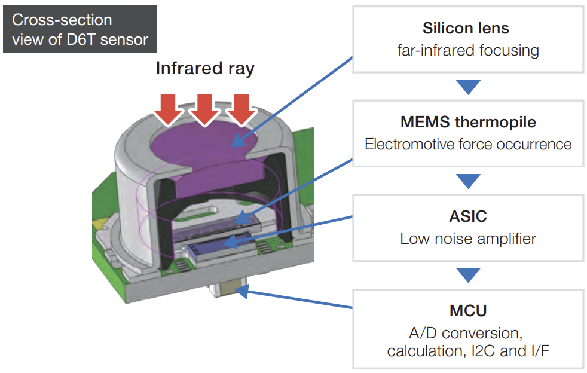

# STM_Praktikum Sensor D6T-32L-01A
Dieses Projekt bezieht sich auf den Kurs Mikrocontroller an der Unversität Bayreuth. Ziel des Kurses ist es Daten eines Sensors, in diesem Fall eines Infrarotsensors, mithilfe eines Entwicklungsboards auszulesen und auf dem Board, oder dem verbuundenen Bildschirm wiederzugeben.

Die Ausgabe der Sensorwerte erfolgt etwa alle zwei Sekunden auf dem Display des Entwicklungsboards in Form eines farbigen Bildes. Dabei werden die Temperaturwerte auf einer Farbskala, von Hoch (rot) zu niedrig (blau) über normal (weiß) abgebildet. Für diese Farbscala sind **zwei Modi** verfügbar, zwischen denen durch **halten des Joysticks bis zur nächsten Messung** nach rechts für den relativen Modus (REF), oder nach links (standart) für den absoluten Modus(ABS). 

Im **Absoluten Modus** bildet die Tiefsttemperatur des Sensors laut Datenblatt (10°C) den unteren Rand der Skala und die Höchsttemperatur (70°C) den Oberen. Dazwischen sind noch die die Temperaturn Raumtemperatur (24°) in weiß und Körertemperatur 36° in Orange festgesetzt, um einen stärkeren Ausschlag im Alltäglichen Temperaturbereich zu erziehlen. 

Im **relativen Modus** dagegen wird die tiefste gemessene Temperatur auf Blau gesetzt und die höchste gemessene Temperatur auf Rot. Die Durchschnittstemperatur wird auf Weiß festgelegtund orange bildet den Durchschnitt + 2,5°C ab. Dadurch können Objekte unabhängig von der Umgebungstemperatur sehr gut erkannt werden. 

## Funktionsweise der D6T MEMS Sensoren
Für dieses Projekt war der Infrarotsensor D6T-32L-01A gegeben, der 32x32 Temperaturwerte einer Rechteckigen Fläche erfasst:

Auf diese Temperaturwerte kann über das $I^2C$ Protokoll zugegriffen werden. Das $I^2C$ überträgt Daten in digitaler Form, über zwei Leitungen, Dabei wird eine als Pulsgeber (Clock) und die andere als Datenleitung genutzt. Die kommunikation mittels $I^2C$ erfolgt bidirektional nach dem Master-Slave prinzip, wobei der Mikrocontroller den master und der Sensor den Slave darstellt und hat immer folgenden Aufbau:

 1. Startbedingung S: Die Kommunikation beginnt mit einer Startbedingung (eine Änderung des SDA (Serial Data Line) von HIGH auf LOW).
2. Adressierung: Der Master sendet die Adresse des Slave, für den D6T ist das `0x14`, zusammen mit einem Bit, das angibt, ob es sich eine Lese- oder Schreiboperation handelt.
3. Datenübertragung: Der Slave sendet eine Bestätigung und die Datenübertragung beginnt.
4. Stopbedingung: Die Kommunikation endet mit einer Stopbedingung, die vom Master gesendet wird (Änderung des SDA von LOW auf HIGH).
* Jede Kommunikation auf der Datenleitung wird in jedem Schritt von der anderen Seite Acknolaged (ACK)

Da das $I^2C$ Protokoll lediglich 8-bit Daten unterstützt, müssen die 16-bit Temperaturwerte in HIGH- und LOW- Bits übertragen werden. Diese werden dann auf dem µC wieder zu einem 16Bit temperaturwert zusammengesetzt. Diese Werte beschreiben in diesem Fall die 10-Fache Temperatur. 

Diese Themperatur wird im Sensor durch das Folgende Setup gemessen: 

Abbildung 2: 

Die einfallende Infrarot-Strahlung wird durch eine Silikon-Linse auf einen Thermophilsensor gebündelt und es wird die dabei resultierende Kraft gemessen. Durch den Vergleich mit einer internen Lookup-Tabelle wird die Temperatur des Infrarot-Strahlen emittierenden Objekts ermittelt. Diese Werte können dann über das $I^2C$ Protokoll ausgelesen werden.

## Getting started
Für die Durchführung wurde folgendes Setup verwendet :
* Ein D6T-32L-01A IR Sensor, der mit 
* einem STM32F412G-Discovery board (hier mit µC abgekürzt) mit  
* einem Qwiic zu 4-male jumper pin kabel verbunden ist.
* ein Mikro-USB Datenkabel zur Stromversorgung und zum Programmieren des µC wird ebenfalls benötigt.

Für weitere Informationen zu dem Sensor und MikroController(kurz µC) verweise ich auf die jeweiligen Datenblätter:
* [Datenblatt D6T](https://cdn-reichelt.de/documents/datenblatt/B400/D6T_MANUAL-ENPDF.pdf) 
* [Datenblatt STM32](https://www.st.com/en/evaluation-tools/32f412gdiscovery.html#documentation)
### Verkabelung
Abbildung 3:

Die Kommunikation zwischen µC und D6T findet über das $I^2C$ Protokoll statt. Der $I^2C$ Port befindet sich auf der dem LCD-Display abgewandten kurzen Seite des µC, unterhalb des USB Connectors, der für die Stromzufuhr und Programmierung des µC verwendet wird. Der $I^2C$ Port des D6T dagegen, kann an der unterseite in Form eines Qwiic anschluss gefunden werden. Die Farben der in der Abbildung verwendeten Kabel haben die Folgende Bedeutung:
* Gelb:    SCL ($I^2C$ Clock)
* Blau:    SDA ($I^2C$ Datenleitung)
* Rot:     VCC (Stromzufuhr)
* Schwarz: GND (Ground)

### Sofftware auf dem µC installieren
Für dieses Projekt wurde die frei zum Download verfügbare Software STM32CubeIDE verwendet. Mithilfe dieser Software kann das Projekt auch auf den Mikrocontroller gespielt werden. Dazu muss das geklonte Archiv als Projekt geöffnet werden, der µC durch ein Daten-Kabel mit dem Computer verbunden, und der grüne Play-button am oberen Rand der Oberfläche gedrückt werden. 

### Software zurücksetzen
0. Das programm beinhaltet bereits einen Watchdog Timer, der etwa alle vier Sekunden das Programm zurücksetzt, sollte dies nicht mehr reagieren. Sollte dennoch das Programm nicht Funktionieren können folgende Schritte versucht werden:
1. Das Neu-Starten des Sensors erfolgt, in dem entweder die VCC, oder GND Leitung getrennt und neu verbunden werden
2. Das Auf den Sensor gespielte Programm lässt sich manuell neu starten, indem der Restart Knopf (Siehe Abbildung 3) gedrückt wird.

## Software Architecture and Design decisions
The presentated software to read the sensor data has been moved to a Folder called `/Core/.../sensor/` to enable the construction of different logically seperated components. This folder has an access point for the main method called `d6t.h` in which the main streamline of the constructed methods were executed. These method have been seperated into two files:
1. `.../sensor/communication.h/c` in the communication files the methods focus on getting the raw data from the sensor and interpret it in a way that it fits to a for Humans readable value in °C. Even thoug the task requests iso units, I chose not to comply as the stepsize between Kelvin and Celsius are identical and a calculation to Kelvin would only take more space on the small Display as the numbers are 272.15 bigger that Celsius's system. I decided the conversion is easy enough that it is not worth the extra space.
2. `.../sensor/render.h/c` contains the code used to visualize the data we got from the sensor on the evaluation board screen. ... /// how and why like this

## Autor
Yannick Pahlke 1841500 (@Reskuzo on Github)

## Quellen

